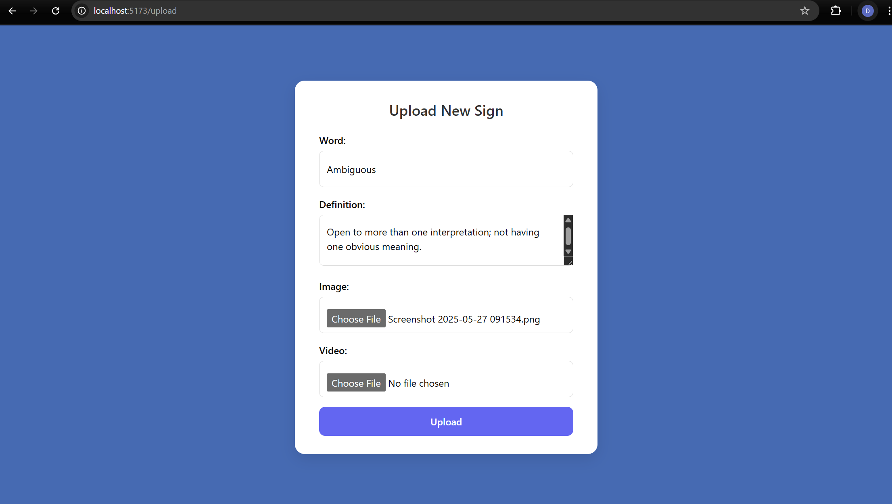

<h1 align="center">🚀 SignSetu Demo</h1>


---

      <h2>🌟 Application Features</h2>
<ul>
  <li>🔍 <strong>Smart Search (Fuzzy Logic)</strong><br/>
    - Intelligently search words even with typos or partial inputs<br/>
    - Enhanced user experience with real-time suggestions
  </li><br/>

  <li>🏡 <strong>Interactive Home Page</strong><br/>
    - Search bar with typo-tolerant (fuzzy) search<br/>
    - Displays Word, Definition, Image (via URL), and Video (via URL)
  </li><br/>

  <li>📝 <strong>Word Submission Form</strong><br/>
    - Input fields for new word, its definition, image link, and video link<br/>
    - Automatically saved to MongoDB database
  </li><br/>

  <li>⚙️ <strong>Advanced Options (Bonus)</strong><br/>
    - Ability to edit or remove added words<br/>
    - Responsive layout for seamless mobile experience<br/>
    - Displays a loading spinner during data fetching
  </li>
</ul>

   


---


# 🖥️ Tech Stack

## 🚀 Frontend

<p align="left">
  
  
  
  
  
 
</p>

## 🛠️ Backend

<p align="left">
  
  
  
  

>
</p>

---

## 📸 Preview




---


## 🛠️ How to Run DevMinds Locally

### 🔧 Prerequisites

Make sure you have the following installed on your machine:

- [Node.js](https://nodejs.org/)
- [npm](https://www.npmjs.com/)
- [MongoDB](https://www.mongodb.com/)
- [Git](https://git-scm.com/)


### 📦 Installation

#### 1. Clone the Repository

```bash
git clone https://github.com/DhruvSingla33/signSetudemo.git

```
#### 2. Install Dependencies

```bash
# Frontend
cd client
npm install

# Backend
cd server
npm install 
```


### 🚀 Running the App

Open two terminals and run:

#### 🖥️ Terminal 1: Start Backend

```bash
cd server
npm run dev
```
#### 🖥️ Terminal 2: Start Frontend

```bash
cd client
npm run dev
```


### ✅ Ready to Go!

Visit your app at:

- 🔗 Frontend: [http://localhost:5173](http://localhost:5173)
- 🔗 Backend: [http://localhost:8000](http://localhost:5000)

---

### 📬 Contact

Feel free to reach out for questions, collaborations, or feedback:

- 📧 Email: [singladhruv301@gmail.com](mailto:your.email@example.com)  
- 💼 LinkedIn: [https://www.linkedin.com/in/dhruv-singla30/](https://www.linkedin.com/in/your-username)

